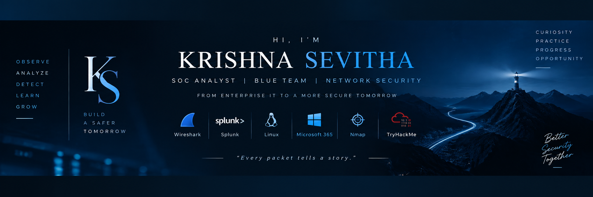

  

<h1 align="center">Hi, I'm Krishna Sevitha 👋</h1>

<h3 align="center">
Enterprise IT → Cybersecurity | Aspiring SOC Analyst | Blue Team
</h3>

  
  

---

## About Me

I'm an Enterprise IT professional transitioning into **Blue Team Cybersecurity** through hands-on SOC investigations, Linux administration, Wireshark packet analysis, Splunk, and practical security projects.

My goal is to become a **SOC Analyst** by demonstrating real-world investigation skills and continuous learning.

---

## Snapshot

| 🛡️ Experience | 🎯 Goal | 🔍 Focus | 📚 Learning |
|---|---|---|---|
| **2.5+ Years** Enterprise IT | SOC Analyst | Blue Team Investigations | Continuous Growth |

 

## 🛠️ Technical Skills

<table>
<tr>
<td width="33%" valign="top">

### 🔐 Cybersecurity

Wireshark • Linux • Nmap

</td>

<td width="33%" valign="top">

### 💼 Enterprise IT

Microsoft 365 • SCCM • JAMF • Okta • Active Directory

</td>

<td width="33%" valign="top">

### 🐧 Operating Systems

Linux • Kali Linux • Ubuntu

</td>
</tr>
</table>
